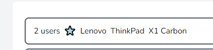

# Purpose of Repository 

This was a project done at University. The original version of this was private- this
is a re-uploaded version for public code visibility.

# Laptop Site:

## Description:

The purpose of this site is to allow for users to browse various laptops. Users can sign up for accounts in order to add new laptops, edit details of and favorite existing laptops as well.

Laptops can have images uploaded. They can also be searched for. Admin users can see every user's favorite laptops, and users can log in with various existing services as well.

## Technologies Used:

The technologies that I have used are:

-   Laravel as the framework, and all of it's defaults, such as:
    -   PHPUnit for testing.
    -   Git for version control.
    -   Composer for installing PHP packages
    -   npm for installing Node packages and building front-end assets.
-   Officially recommended [Laravel Breeze](https://laravel.com/docs/8.x/starter-kits#laravel-breeze) package for user authentication.
    -   Laravel Breeze uses [Tailwind](https://tailwindcss.com/). As such, Tailwind was used for this project as well.
-   GitHub as the remote version control solution.
    -   The default [GitHub action](https://github.com/actions/starter-workflows/blob/1d8891efc2151b2290b1d93e8489f9b1f41bd047/ci/laravel.yml) for Laravel projects was used to run all tests before merging to master.
-   Socialite plugin, used for 'Log in With ...' functionality.
    The following tutorial was used and adapted to implement this feature.
    -   Laravian, R. Easily Add Social Logins to your App with Socialite. Sitepoint. https://www.sitepoint.com/easily-add-social-logins-to-your-app-with-socialite/
-   Sail plugin, for setting up Docker integration.

Whilst not technologies, I have also used the following resources:

-   [HeroIcons](https://heroicons.com/), by the same people who make Tailwind- SVGs for various icons ('star' icon for favorites and 'pencil' icon for edit)
-   [Success Icon](https://icons.veryicon.com/png/o/miscellaneous/cloud-call-center/success-24.png)
-   [Error Icon](https://cdn0.iconfinder.com/data/icons/basic-ui-elements-color-round-icon/254000/85-1024.png)
-   [Logo](https://www.vexels.com/png-svg/preview/128132/flat-laptop-icon-design)

Images for some of the default seeded laptops have been included. These are the following images sources:

-   [Acer Inspire](https://www.walmart.com/ip/Acer-Aspire-5-A515-44G-R83X-15-6-FHD-Laptop-AMD-Ryzen-5-8GB-RAM-256GB-SSD-Windows-10-Home-Pure-Silver-NX-HW6AA-001/941994884)
-   [Asus Viviobook](https://archiwum.allegro.pl/oferta/asus-vivobook-17-x705qa-a12-8gb-256ssd-1t-r7-win10-i8633967835.html)
-   [Apple Macbook Air](https://www.apple.com/uk/shop/buy-mac/macbook-air)
-   [Dell XPS](https://www.currys.co.uk/gbuk/computing/laptops/laptops/dell-xps-15-9510-15-6-laptop-intel-core-i7-1-tb-ssd-silver-10226160-pdt.html)
-   [Dell XPS Developer Edition](https://www.omgubuntu.co.uk/2019/08/dell-xps-13-9th-generation)
-   [Lenovo Thinkpad](https://notebooks.com/2013/01/02/lenovo-thinkpad-x1-carbon-touch-arrives-with-windows-8/)
-   [Lenovo Yoga C940](https://secinfinity.net/lenovo-fuhrt-aktualisierte-yoga-laptops-mit-neuen-prozessoren-und-verbesserter-alexa-integration-ein/)
-   [System 76 Galago Pro](https://megaobzor.com/Predstavlen-Linux-noutbuk-System76-Galago-Pro-na-Intel-Core-8-go-pokolenija.html)
-   [Tuxedo InfinityBook](https://www.tuxedocomputers.com/en/Linux-Hardware/Linux-Notebooks/15-16-inch/TUXEDO-InfinityBook-Pro-15-v5-RED-Edition.tuxedo)

Any other, smaller pieces of code that were used are referenced above the where the code is used.

## Features:

The main features of the application are:

-   User sign in and management (create account, view and update details, delete own account).
-   Browse various laptops.
-   Laptop management (create laptops, view and update details, delete laptops).
-   Favorite laptops- favorite and link laptops to your signed in user account.
-   Search Menu:
    The ability to search for laptops has been added to the system. This will be discussed in more detail in the [Reflective Analysis](#reflective-analysis-search-menu)
-   Laptop Image Upload:
    The ability to upload images for laptops has been added. When adding a laptop to the system, you will be able to (optionally) upload an image for this laptop. You will be able to edit or remove this image in the 'Edit' page. These images are stored in the database. In a real-world website, the images would likely be stored in different ways (one likely way being on a server with a file path being stored in the database). However, as there is no centralized server to store these images on for this assessment, they have been included in the database. They were not included in the file system and referenced to via storing a file path as there would have been no way to share these files other than Git, and uploading, editing and removing images should not affect the websites version control status. As such, for the purpose of this assessment, the chosen way of storing images was to simply store them in the database.
-   'Log in With Google/GitHub' OAuth functionality:
    The user can log in and register an account with an existing Google or GitHub account, and a corresponding Laptop Site account will be made. My OAuth application in the Google Cloud Platform is currently in the 'Testing' phase. As such, the accounts that can be used with 'Log in With Google' may be locked down to certain accounts. I have been able to log in with every account that I have tried. I was provided with an email address from Andrew Flannery to use with this system. This email address should be whitelisted and should work. If not, I believe the 'Log in With GitHub' option should work fine.
-   'Admin Favorites':
    Admin users now exist in the system. These users can visit the 'Admin Functionality' page, which allows them to see a list of all laptops and who has favorited them. They can also search by particular user or laptop to only see the details they want to see. Admin users are prompted with a link from any 'Laptop Cards' throughout the system to jump straight to this particular laptop's 'Admin Favorite' page. Model Relationships were introduced into the system, and used in many aspects of the system, but most notably relating to users and their favorited laptops. Admin users can also toggle the 'Admin Status' of other users on this page.

### Reflective Analysis: Search Menu

The 'Search Menu' feature that I added can be seen on the main 'Laptops' (or index) page, as well as on the 'Favorited Laptops' and 'Manage Laptops' pages. This feature allows for the user to search for particular laptops based on various criteria. There are two 'levels' of this feature. The first allows for the user to search for a particular make of laptop (such as 'Thinkpad' or 'Mac'). The second level can be accessed by the user clicking on the 'Advanced' option next to the 'Search' button.

These advanced options allow for a larger range of options and criteria to be searched for. Rather than just the make name, you can search for the manufacturer and the model of the laptop. You can also search by price, RAM, SSD size and screen size. These four options are searched by entering (one or both sides of) a range. For example, you can search for laptops over £400, under £900 or only laptops in the range of £400 to £900 as an example.

You can combine criteria. You could search for all laptops with 'Idea' in their make name, that are made by Lenovo, that cost over £400. With the default seeded data, this should return two laptops. You could then add more criteria- you could also search for 'i' in the model name, which will narrow the results to only one laptop. You could instead have added 'costs less than £500' to the previous query, which would return the other laptop. Different search criteria can be combined and should lead to the expected result. Any details that you change or new laptops that you add should work with the search menu as well as existing laptops.

The Eloquent query for the search criteria is build up option by option- so if you enter a value to search for in a criteria, this criteria is added to the Eloquent query. The upside of this is that queries are minimal, only checking what they need to.

An alternative for implementing my Search functionality this way would have been using existing libraries. Once such library is [Algolia](https://www.algolia.com/). This offers similar/more advanced functionality to what I have implemented. The main reasons why this was not chosen include over-complexity (at the scale of my assessment website, the features offered by this service are unnecessary- though potential future expansions could benefit from these features) and the fact that there is no self-host option. All data in the system that could be searched needs to have a copy/be stored on Algolia's servers- as this is an assessment project, I feel as if I should be more responsible for how features operate- storing searchable data on another service seems to go against how an individual assessment should work (even if it is a possibility for a real world application).

# Installation:

Removed from Public version 

# Usages:

If you have performed the steps detailed in the 'Installation' section of the README correctly (and assuming the default Docker configurations are used), you should now be able to access the website from 'localhost' (or equivalent, depending on the webserver you used).

By opening 'localhost', you should be redirected to the 'laptops' page (at 'http://localhost/laptops'). This page will show you all of the laptops in the system. Each laptop should have an 'edit' and a 'favorite' button- clicking these will allow you to edit the details of a laptop and mark a laptop as a favorite, respectively. You should also see a search menu.

You can view and search this 'laptops' page whilst logged out, but attempting to use any of the other functionality (such as the aforementioned edit and favorite) will require you to log in first.


You can press the 'Advanced' option near the search menu to be presented with more options, as shown below:


The 'View All Laptops, 'Your Favorited Laptops' and the 'Manage Laptops' pages all have this search bar, and it behaves in the expected way on each page.

On the login and register pages, you should be able to see and use options to 'Log in With' Google and GitHub. These options should look like the below screenshot.


You can login or register a new account from the top-right menu in the navigation bar. All default users have the password 'password'. Once logged in, this menu will be filled with options to manage your own profile and log out. From the 'Your Profile' option, you can choose to edit your profile details or delete your account.


Once logged in, you should be able to see 'Your Favorited Laptops' and 'Manage Laptops' options in the navigation bar. The 'Your Favorited Laptops' page only shows you the laptops you have favorited. 'Manage Laptops' allows you to add a new laptop into the system, edit an existing laptop's details or delete a laptop from the system.


If you log in as an admin user (with the default seeded data, this should be 'admin@email.com' with the regular password), you should be able to see a 'Admin Functionality' link in the navigation menu that only Admin's have access to. Clicking this link should take you to the following page:


This page shows you a list of all laptops and which users have favorited them. You can also choose to only see the details for a particular user or laptop.

Admin users can also toggle the 'Admin Status' of other users on this page:


Admin users are also presented with more information about laptops than regular users. On the 'Laptop Cards', admin users are presented with an extra line, showing them how many users have favorited this laptop:

Main Laptop Card:


Manage Laptop Card:



Clicking on this link should take the user directly to the Admin page, filtered to only show this laptop and which (in this case, two) users have favorited this laptop.

The site is designed to be responsive, so you should be able to easily access all features from any device.


# Testing:

Below is a screenshot of all the tests in the system, and in the screenshot all of them pass.


The 'test_need_one_test_in_the_unit_folder_to_run_php_artisan_test_command()' test is needed as removing all tests from the 'Unit Folder' makes it so tests cannot be run at all.

This project uses PHPUnit for it's testing, as this is included in Laravel by default. Tests were set to run automatically on every push to master using GitHub actions.

In order to run the tests, with the servers started, open the root of this project in a terminal and run the command:

```
sail artisan test (if running via Docker)
```

or

```
php artisan test (if running via manual install)
```

This should run all of the tests included in the project.

Running the tests may remove the contents of the database. This is due to the use of the 'refreshDatabase' functionality to ensure a fresh database before running tests. You can run the command 'php artisan migrate:refresh --seed' in order to re-populate the database after running the tests if the data is removed.
